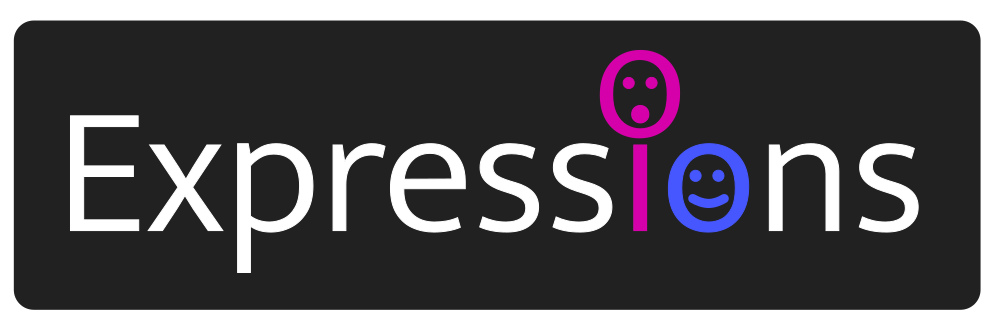

<a href="https://rubygems.org/gems/expressions" title="Install gem"></a>

<p align="center"></p>

# Expressions

Expressions evaluate into useful objects via a query builder like interface.

## API

**Expressions** provides an API for expression types. You can build your own `Expression`, or use expressions created via the gems below:

### Type Expression

```ruby
# Via method definition:
def method(my_var: MyType); end

# Via type() helper:
my_var = type MyType | fetch_my_object(id: 123)
```

`my_var` is now type checked to be of type MyType when assigned to.

ℹ️ **See:** [LowType](https://github.com/low-rb/low_type)

### Dependency Expression

```ruby
def method(my_var: Dependency); end
```

`my_var` is now automatically assigned to via dependency injection.

ℹ️ **See:** [LowDependency](https://github.com/low-rb/low_dependency)

### Data Expression [UNRELEASED]

The table expression inverts the usual database query logic. Instead of building a query of what we want from the database, we build the table we want and let the expression build the query.

```ruby
table(:username > :title | :body)
```

The above expression builds a ORM query to right join the user table into the articles table and results in a list of articles with the user's username in each row

ℹ️ **See:** [LowData](https://github.com/low-rb/low_data)

## Installation

Gems using Expressions will do this step for you, but if you'd like to build your own expression then add `gem 'expressions'` to your Gemfile and run:

```
bundle install
```
